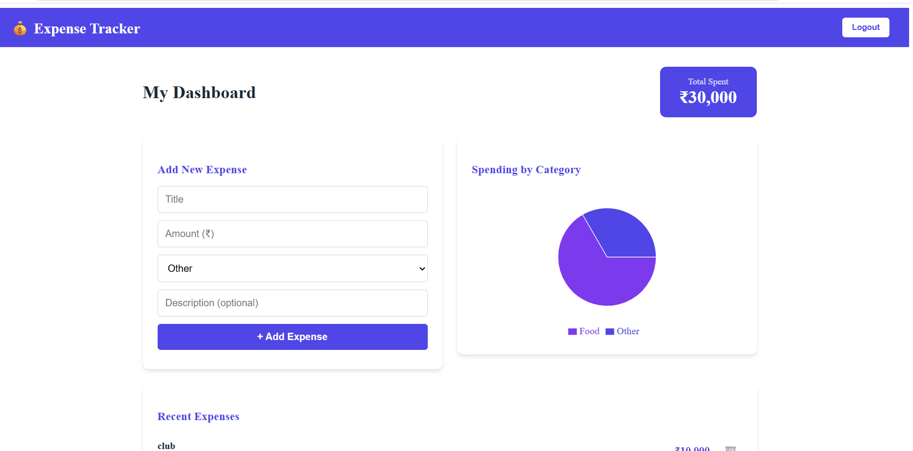
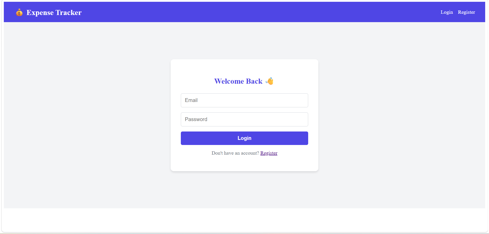

# 💰 Expense Tracker

A full-stack MERN expense tracking application with JWT authentication and data visualization.

## 🚀 Live Features
- User Registration & Login with JWT Authentication
- Add, View & Delete Expenses
- Category-wise Pie Chart Visualization
- Responsive UI Design
- Secure Password Hashing with bcryptjs

## 📸 Screenshots

### Dashboard

### Login

## 🛠️ Tech Stack

### Frontend
- React.js
- React Router DOM
- Axios
- Recharts (Data Visualization)

### Backend
- Node.js
- Express.js
- MongoDB Atlas
- Mongoose
- JWT (JSON Web Tokens)
- bcryptjs

## 📦 Installation & Setup

### Clone the repo
git clone https://github.com/Ashesh88/Expense-Tracker.git
cd Expense-Tracker

### Backend Setup
cd backend
npm install
npm run dev

### Frontend Setup
cd frontend
npm install
npm start

## 🔑 Environment Variables
Create a `.env` file in backend folder:
MONGO_URI=your_mongodb_connection_string
JWT_SECRET=your_jwt_secret
PORT=5000

## 👨‍💻 Author
**Ashesh Singh**
- GitHub: [@Ashesh88](https://github.com/Ashesh88)
- LinkedIn: [asheshsingh01](https://www.linkedin.com/in/asheshsingh01/)
